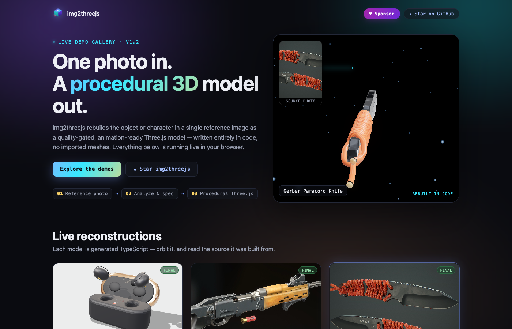
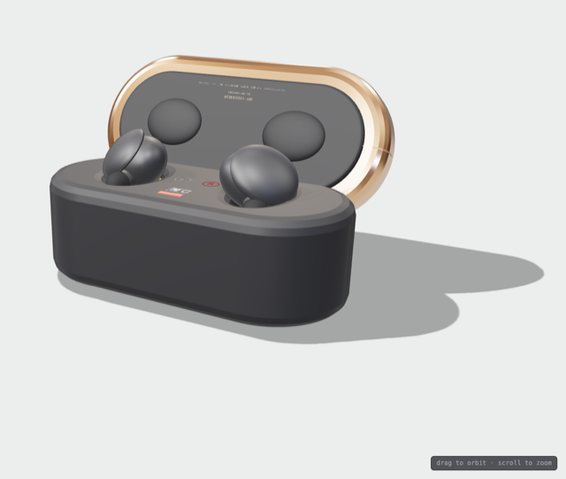
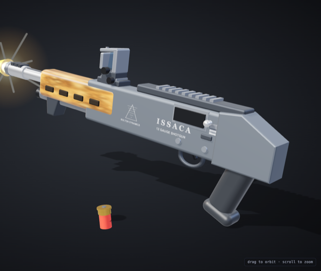
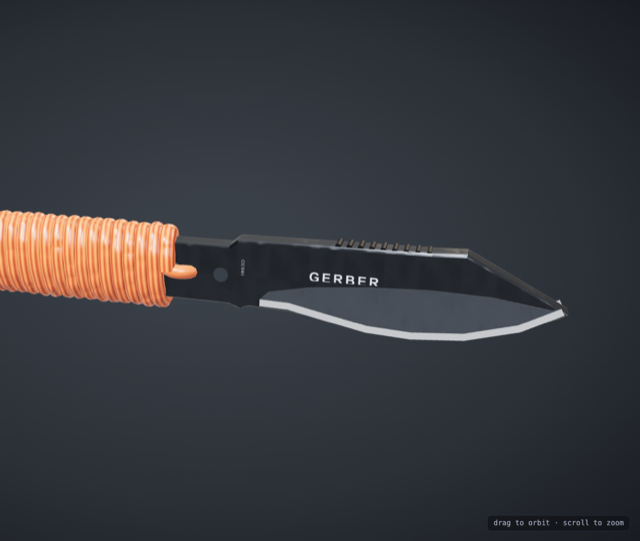
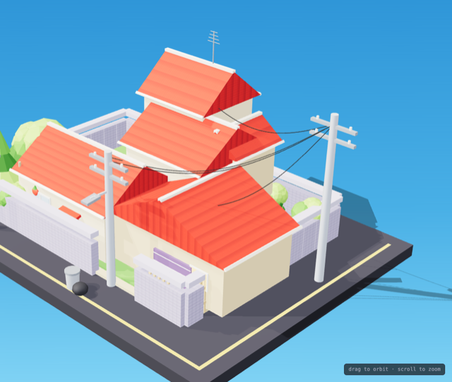
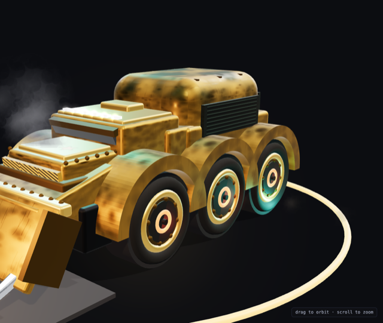
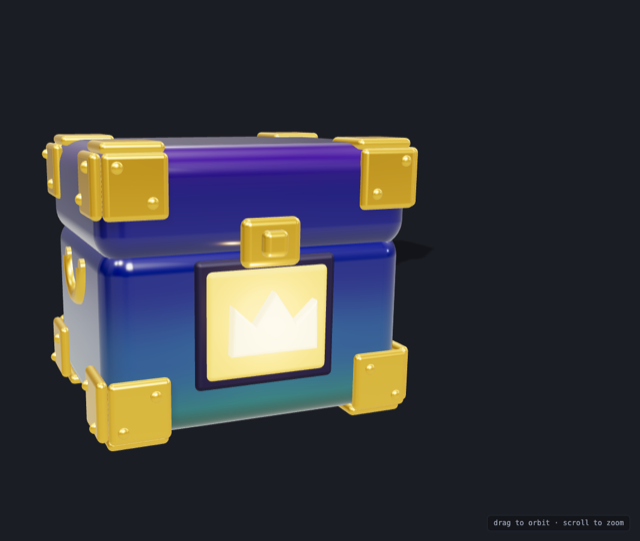

# img2threejs-showcase

[](https://github.com/hoainho/img2threejs-showcase/actions/workflows/deploy.yml)
[](https://github.com/hoainho/img2threejs-showcase/actions/workflows/pr-safety-check.yml)

A live gallery of procedural Three.js models generated by
[img2threejs](https://github.com/hoainho/img2threejs) — a tool that turns a
single reference photo into a **code-only, animation-ready 3D model**. No
imported meshes, no downloaded art packs: every object below is built by a
TypeScript factory function, running live in your browser.

<p align="center">
  
</p>

**Live gallery →** https://hoainho.github.io/img2threejs-showcase/
Click any card for the full-viewport viewer (`#/demo/:id`): drag to orbit,
scroll to zoom, and read the reference photo it was rebuilt from.

## Showcases

<table>
<tr>
<td width="240"></td>
<td>

**[Sony WF-1000XM3 Earbuds + Case](https://hoainho.github.io/img2threejs-showcase/#/demo/sony-wf1000xm3)**
Matte-black true-wireless earbuds + case with rose-gold trim; the lid opens
and both buds spin in a looping animation.
`object` · `final` · by [Hoài Nhớ](https://github.com/hoainho)

</td>
</tr>
<tr>
<td width="240"></td>
<td>

**[ISSACA 12 Gauge Shotgun](https://hoainho.github.io/img2threejs-showcase/#/demo/issaca-shotgun)**
Stylized bullpup shotgun with a working muzzle flash, full recoil kick, and
an ejecting shell.
`object` · `final` · by [Hoài Nhớ](https://github.com/hoainho)

</td>
</tr>
<tr>
<td width="240"></td>
<td>

**[Gerber Paracord Knife](https://hoainho.github.io/img2threejs-showcase/#/demo/gerber-knife)**
Skeletonized tactical knife wrapped in orange paracord, slowly rocking on a
studio turntable to catch the stonewash finish.
`object` · `final` · by [Hoài Nhớ](https://github.com/hoainho)

</td>
</tr>
<tr>
<td width="240"></td>
<td>

**[Doraemon House (isometric diorama)](https://hoainho.github.io/img2threejs-showcase/#/demo/doraemon-house)**
Isometric residential diorama with swaying trees, twinkling dusk windows,
and both characters resting on the roof.
`object` · `final` · by [Hoài Nhớ](https://github.com/hoainho)

</td>
</tr>
<tr>
<td width="240"></td>
<td>

**[War-Hauler "SECTOR 07"](https://hoainho.github.io/img2threejs-showcase/#/demo/warhauler)**
Armored 6-wheeled hauler with glowing reactor hubs, exhaust smoke, and
rolling wheels.
`object` · `final` · by [Hoài Nhớ](https://github.com/hoainho)

</td>
</tr>
<tr>
<td width="240"></td>
<td>

**[Crowned Loot Chest](https://hoainho.github.io/img2threejs-showcase/#/demo/crown-chest)**
Rounded loot chest with a purple-to-teal enamel gradient and an emissive
crown emblem. *(placeholder mesh — not yet a final img2threejs reconstruction)*
`object` · `placeholder` · by [Hoài Nhớ](https://github.com/hoainho)

</td>
</tr>
</table>

This section is maintained by hand — when you add a demo (see below), add a
row here with a screenshot too.

## Add your own showcase

1. **Generate a model** with the [img2threejs](https://github.com/hoainho/img2threejs)
   skill. Reconstruction must be code-only — no imported mesh, no downloaded
   texture pack.
2. **Fork this repo**, branch off `main`, and add three files:
   - `src/demos/<id>/createXModel.ts` — your factory, exactly as generated
   - a new entry in the `demos` array in [`src/demos/registry.ts`](src/demos/registry.ts) —
     every `DemoEntry` field is required; set `status: 'final'`, and fill in
     `author` / `authorUrl` so you're credited on the card and demo page
   - `public/references/<id>.png` (or `.jpg`/`.jpeg`/`.webp`, ≤ 800 KB)
3. **Verify locally** before you push:
   ```bash
   npm install && npm run build && npm run preview   # check #/demo/<id>
   node scripts/check-showcase-safety.mjs --base main # same check CI runs
   ```
4. **Take a screenshot** of your demo rendering (same framing as the ones
   above) — you'll attach it to the PR and can add it as a row in the table above.
5. **Open a pull request against `main`** — follow the
   [compare link](https://github.com/hoainho/img2threejs-showcase/compare)
   or run `gh pr create --fill` (the PR description auto-fills from
   [`PULL_REQUEST_TEMPLATE.md`](.github/PULL_REQUEST_TEMPLATE.md)).
6. `pr-safety-check` runs automatically and must pass before a maintainer
   reviews. On merge, `deploy.yml` republishes the live gallery — no manual
   deploy step.

Full step-by-step, the approval checklist, and what gets a submission
rejected live in **[CONTRIBUTING.md](CONTRIBUTING.md)** — read it before
opening a PR. You can also open the
[**Submit a showcase demo**](https://github.com/hoainho/img2threejs-showcase/issues/new/choose)
issue form first to get early feedback on scope before doing the work.

## Stack

- three ^0.169.0, TypeScript ^5.6.0, Vite ^5.4.0
- Hash router only (`#/`, `#/demo/:id`) so GitHub Pages project-site refreshes
  never 404
- No runtime network calls or external CDN/fonts — everything is bundled

## Develop

```bash
npm install
npm run dev
```

## Build

```bash
npm run build   # tsc --noEmit && vite build
npm run preview
```

`vite.config.ts` sets `base: '/img2threejs-showcase/'` to match the GitHub
Pages project-site path.

## Project layout

```
src/
  main.ts             bootstrap: mounts the router, handles route changes
  router.ts            tiny hash router
  scene.ts              reusable Three.js viewer (renderer/camera/controls/lights/dispose)
  pages/home.ts         gallery landing page
  pages/demo.ts         per-demo viewer + info panel
  demos/registry.ts     single source of truth for demo metadata + build fn
  demos/<id>/           ported factory source, one folder per demo
```

## Swapping in a placeholder demo

A few registry entries start as `status: 'placeholder'` built from a generic
procedural factory. To replace one with a freshly generated model (as the
maintainer, not via the contributor PR flow above):

1. Drop the new factory file under `src/demos/<id>/` (keep the exported
   function name — copy it in verbatim from the img2threejs output).
2. Update that demo's entry in `src/demos/registry.ts`:
   - point `build` at the new factory's exported function(s),
   - update `referenceImage` if the reference photo changed,
   - set `status: 'final'`.
3. Add the reference image to `public/references/`.

No other files need to change — the router, viewer, and pages read
everything from the registry.
